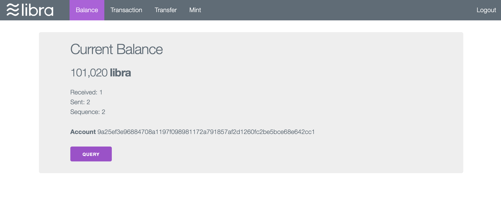

# Libra Wallet

a simple libra wallet example.

[demo](http://10.41.14.195:9000/)

It uses [codemaveric/libra-go](github.com/codemaveric/libra-go) as the libra client library.

**Notice**: It is a a simle example only for single user and implemented for technical verification.